文本图文档

  

plantuml

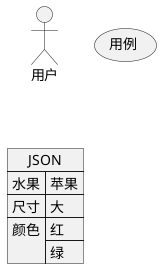


  

plantuml2

​  

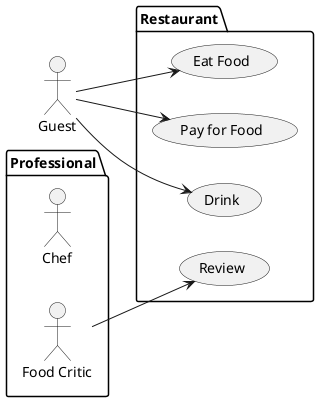


  

  

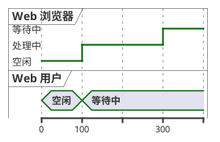


  

```mermaid
sequenceDiagram
  participant User as 用户
  participant Browser as 浏览器
  participant Server as 服务端
  User->>Browser: 输入 URL
  Browser->>Server: 请求服务器
  Server->>Server: 模板渲染
  Server->>Browser: 返回 HTML
  Browser->>User
```


  

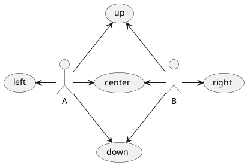


  

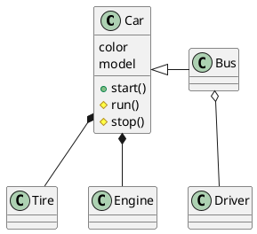


  

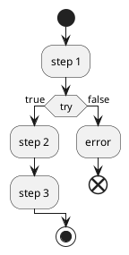


  

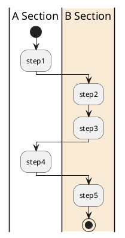


  

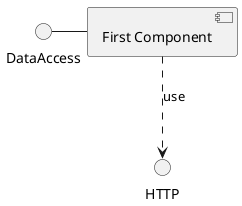


  

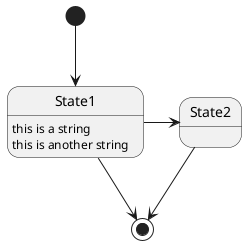


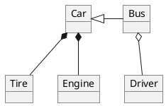


  

  

mermaid

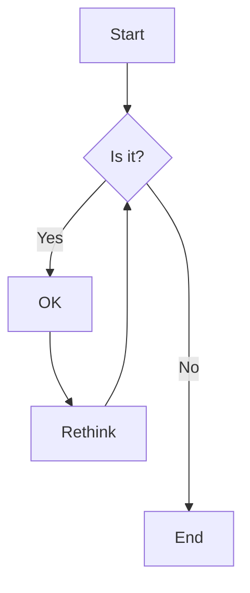


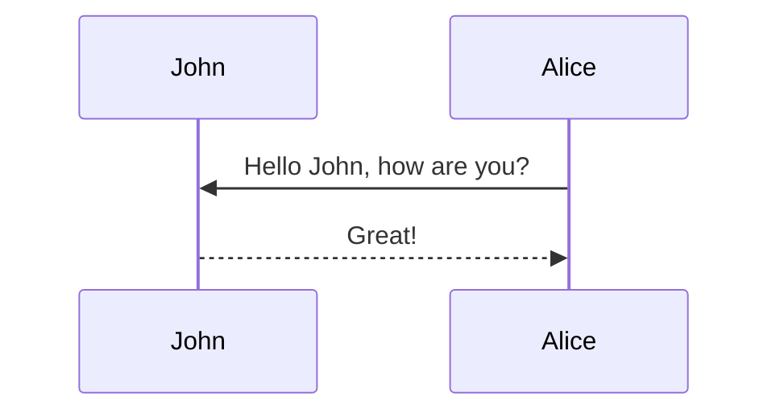


  

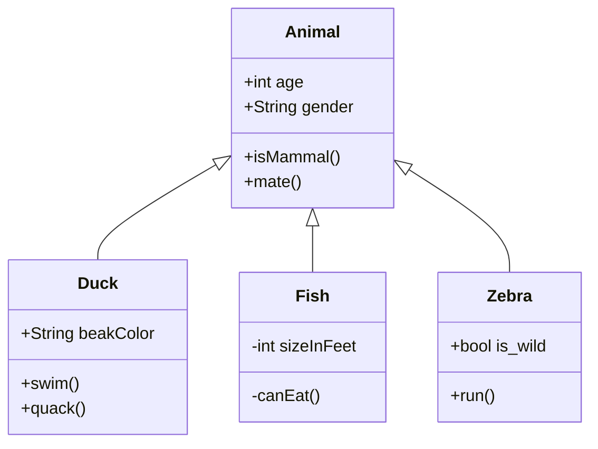


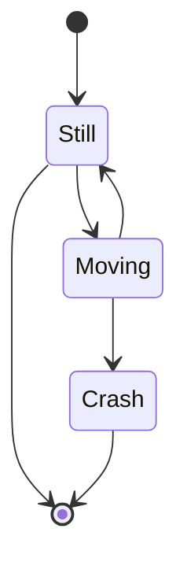


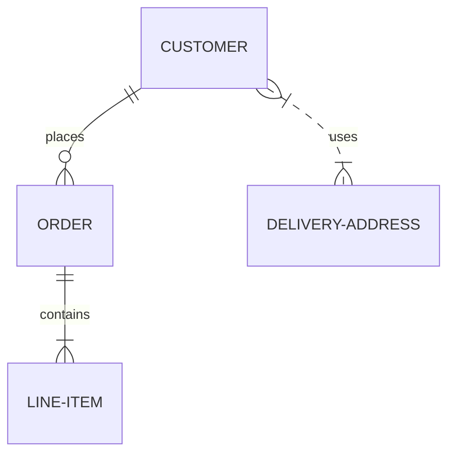


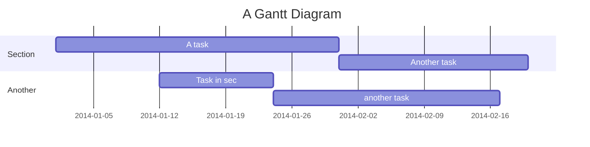


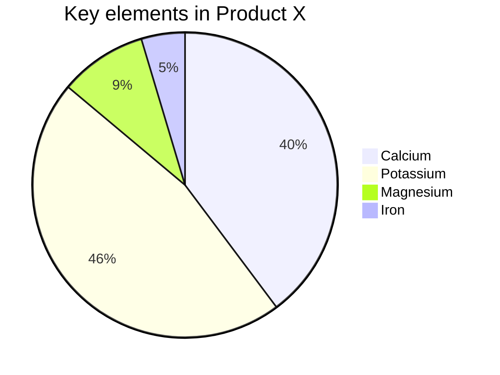


  

flowchart

```flowchart
st=>start: Start
  e=>end
  op1=>operation: My Operation
  sub1=>subroutine: My Subroutine
  cond=>condition: Yes or No?
  io=>inputoutput: catch something...
  para=>parallel: parallel tasks

  st->op1->cond
  cond(yes)->io->e
  cond(no)->para
  para(path1, bottom)->sub1(right)->op1
  para(path2, top)->op1
```


  

graphviz

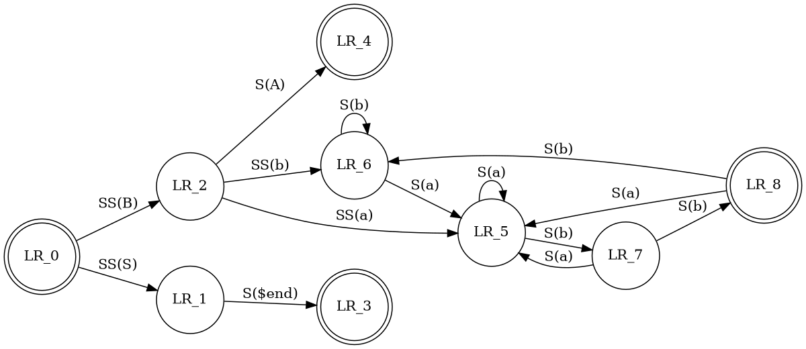


